# AC 

### 1 Introduction

Actor-Critic method reduces the variance in Monte-Carlo policy gradient by directly estimating the action-value function and is able to tackle the environment with continuous action space. However, a naive application of AC method with neural network approximation is unstable for challenging problem. Asynchronous Advantage Actor-Critic (A3C) uses parallel actor-learners which shows a stabilizing effect on training. In A3C, there are several instances of local agent and a global agent. Instead of experience replay, all the local agents asynchronously executed in parallel. The parameter of the global agent is updated by all the local experience.

In this experiment, I implement A3C algorithm and train the agent in a classical RL continuous control scenarios, Pendulum. The inverted pendulum swing up problem is a classic problem in the control literature. In gym's implementation of the problem, the pendulum starts in a random position with a random speed, and the goal is to swing it up so it stays upright. The observation we get is a three dimensional vector about pendulum's position and angular velocity, and the action is a continuous force between -2.0 and 2.0. 

### 2 Procedure

##### 2.1 ACNet

First, I implement a class called `ACNet` , where I build actor and critic network. Actor net has one hidden layer and two output layers. The output layer, $\sigma^2$ and $\mu$, act as the parameter of normal distribution, which sample the final action. Critic net has one hidden layer and outputs the estimation of value function. 

It's worth noting that actor and critic network don't share any parameters.  Supplementary material of original paper recommend this setup in continuous control problems. 

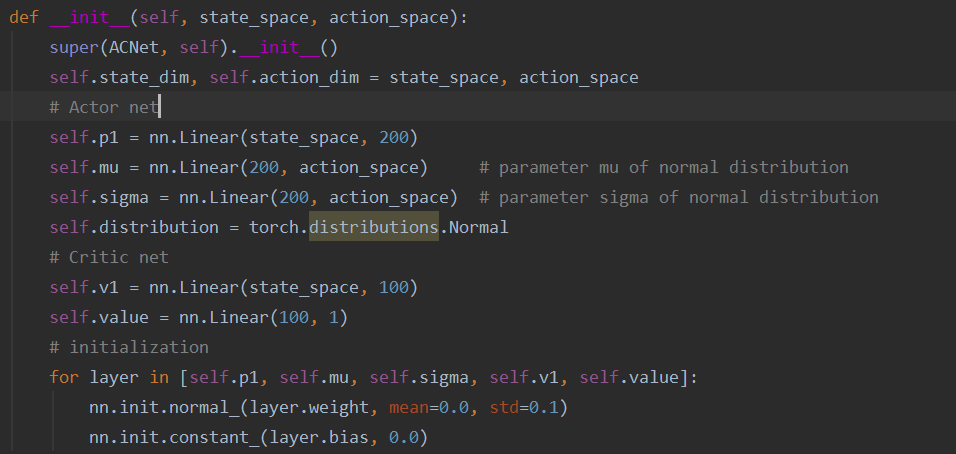

Then I also follow the setup of the original paper. In actor network, µ is modeled by a linear layer and σ 2 by a SoftPlus operation, $\log(1+\exp(x))$, as the activation computed as a function of the output of a linear layer. Value function is also modeled by linear layers.

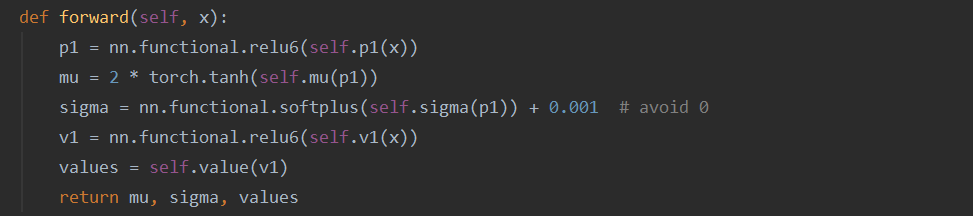

Function `choose_action()` uses distribution to sample an action and this step isn't trainable.

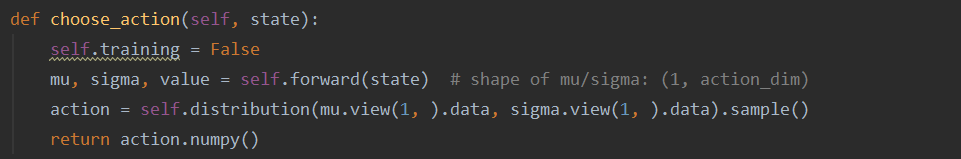

Final loss consists of  loss of actor net and loss of critic net. Loss of critic net is the square of n-step TD error,  which also acts as advantage function $A(s_t,a_t;\theta,\theta_v)=\sum_{i=0}^{k-1}\gamma^ir_{t+i}+\gamma^kV(s_{t+k};\theta_v)-V(s_t;\theta_v)$ .

Then, use function `log_prob(action)` of distribution and advantage function to get the loss of actor net, that is $\log(\pi_{\theta}(s_t,a_t))A(s_t,a_t;\theta,\theta_v)$. Here, a differential entropy of the normal distribution is used to encourage exploration, which is defined by the output of the actor network,  that is $-\frac{1}{2}(\log(2\pi\sigma^2)+1)$.

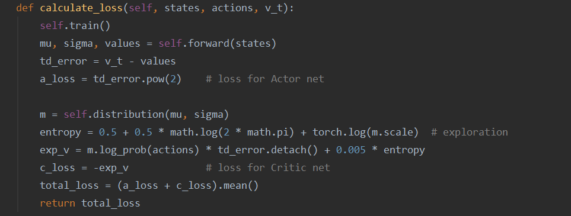

##### 2.2 Worker

In A3C, there are many workers which copy global network's parameters, intersect with environment , and use the experience to compute gradient and update global models.

Class `Worker` is derived from `torch.multiprocessing.Process`. Every worker has their own environment and local network, but share optimizer, global number of episode, global episode reward(Given multi-processing, episode rewards are unstable, so we average several consecutive episode rewards.), result queue(for average episode rewards). `max_ep` is the max number of total episode. `max_ep_step` is the max number of step of an episode. `g_update_iter` is the frequency of updating global network. 

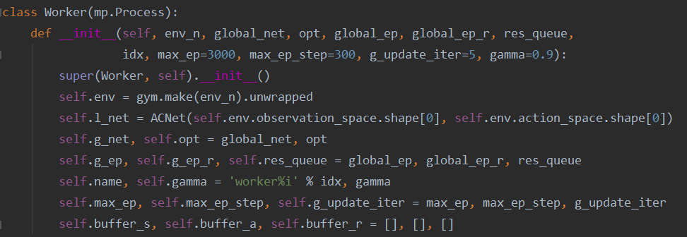

When worker runs, it will start an episode if the global number of episode is less than the maximum. During the episode, it uses local network to interact with its own envronment and then stores results in buffer. When it reaches the frequency of global updating, it updates global network parameters and copies them back and clears the old buffer.

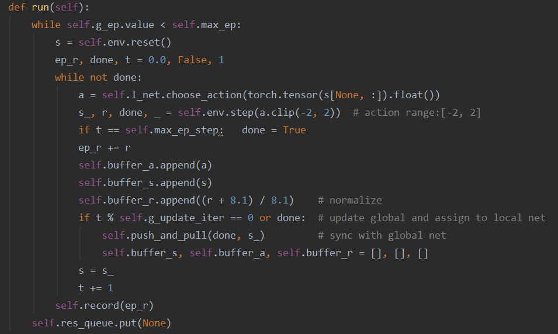

Function `push_and_pull()` calculates n-step TD target and total loss, and then calculates gradient, pushes the local gradient to global network, and then global network is updated. The optimizer's parameters are global network's parameters, so we can only pass local net's gradients rather than parameters and then load parameters from global network.

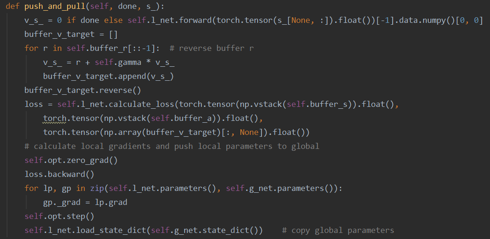

Function `record()` used at the end of each episode in `run()` aims to update those global variables. Because of multi-processing, we need to use `get_lock()` to avoid conflicts.  Given that multi-processing brings unstable episode rewards, I use `g_ep_r` , a moving average reward which can be roughly seen as the mean of ten consecutive episode rewards. 

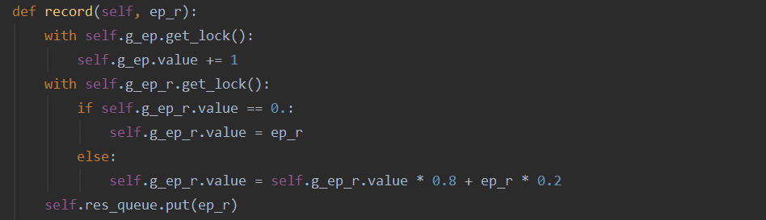

##### 2.3 Adam Optimizer

The original paper found that sharing parameter of optimizer brought better performance, so we need to modify the optimizer and share some parameters. I also do experiments about not sharing parameters which can be found in part 5.

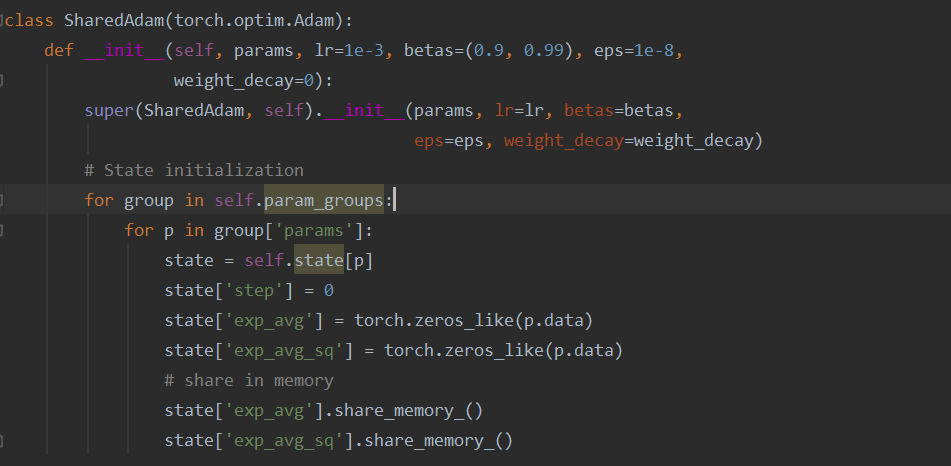

It's worth noting that I use Adam while the paper uses RMSProp. Adam can be viewed as the combination of RMSProp and Momentum and it usually performs better than RMSProp. I also compare their performance in later experiments.

##### 2.4 Training

First, initialize global network and share its memory. Then, initialize the optimizer of global network, some global variables shared among workers, and workers. The number of workers is the number of CPU kernel. Then, start the workers and get results from global queue.

To increase the credibility of experiments, I repeat the training step for several times and use their mean as final results.

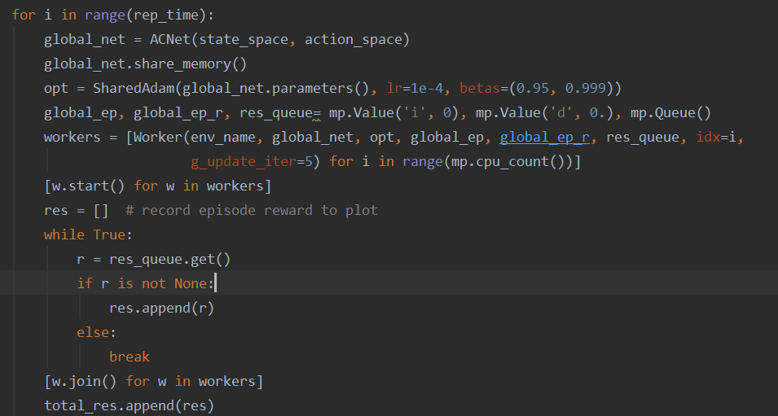

### 3 Results

Here are the main parameters I use in training and they remain the same when I try different global updating frequency . Because there is no terminal state in Pendulum, so it's a good idea to limit the max step of an episode and I set it to 300 step.  Then I limit the total number of episodes to 3000 and set gamma to 0.9.

I have tried different global updating frequency and it turns out that the smaller the global updating step is, the faster the agent converges. But when global updating step is small, it takes a longer time for local worker to push and pull the parameters of global network, that is agent spends longer time to finish 3000 episodes.

### 4 Discussion

##### 4.1 N step Forward View(Global Updating Frequency)

As global update step become smaller, it takes longer time to finish an episode but the performance is better. I guess the larger the global update step is , the more possibly the gradients of different workers will conflict, which may lead to the poor performance.

But it takes longer time to finish an episode when global update step is small, so there is a trade off between training time and performance. Finally, I set it to 5 for most experiments.

##### 4.2 Optimizer 

The original paper used RMSprop as optimizer, but usually, Adam performs better than RMSprop. So I do an experiment to compare them.

The original paper said that SharedRMSprop performed better that RMSprop, and I also do some experiments on Adam and SharedAdam. 

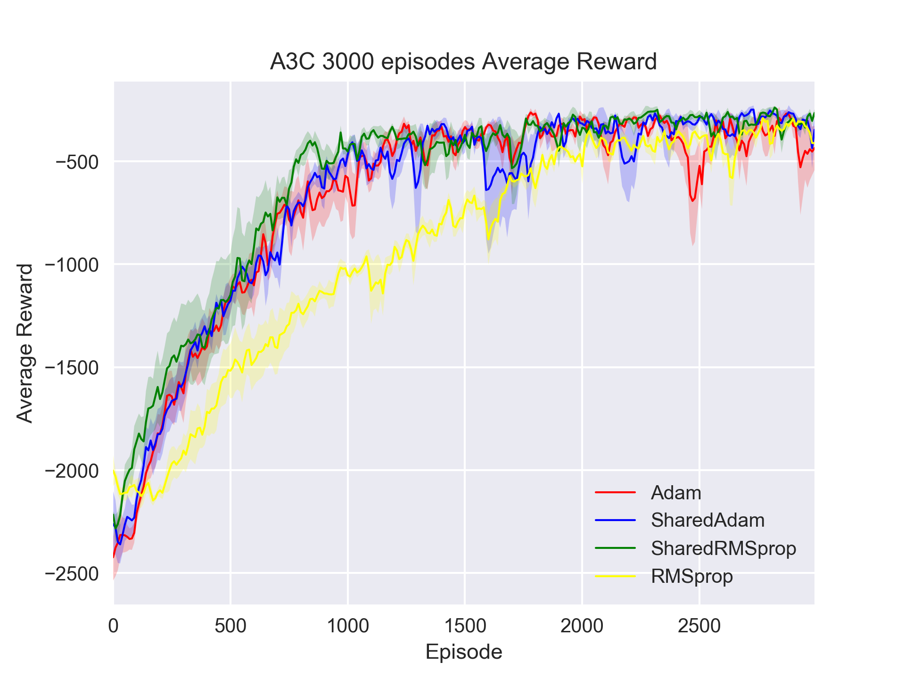

As the digram shows, SharedRMSprop does performed better than RMSprop, but the difference among Adam, SharedAdam, and SharedRMSprop is very small. Maybe it's because this game is not very complex and it's hard to tell their difference.

##### 4.3 Reward Modification

Original step reward is  $-(\theta^2+0.1*\theta^2_{dt}+0.001*action^2)$  and in range of -16.2  to 0, where $\theta$ is the angle and $\theta_{dt}$ is angular velocity. In my experiments, I normalize step reward to $(rewrd-8.1)/8.1$, which makes it in range of -1 to 1.  Under the current setting, modified reward performs better while it's hard for original reward to converge.

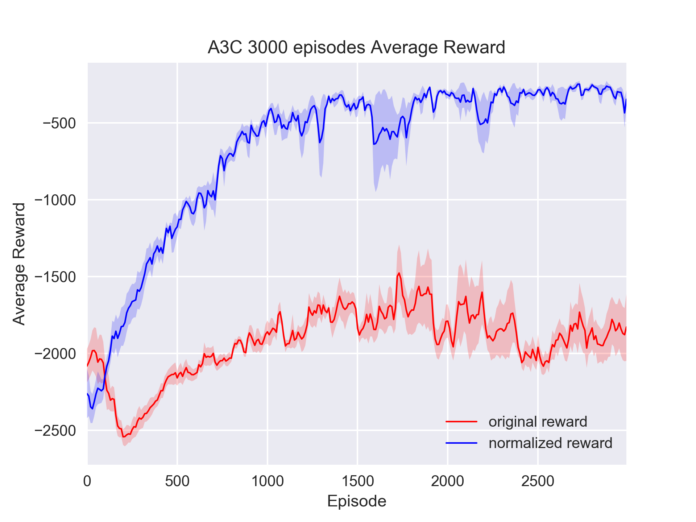

As the digram shows, reward modification does improve agent's performance. But it's also possible that the current parameters are suitable for modified reward, but not for original reward. Maybe, it performs better if I find suitable parameters.

##### 4.4 Number of Workers

Given that I set the a fixed total number of episode (the sum of workers' episode is fixed), the performance of 4 workers and 8 workers are about the same. 4 workers performs slightly better and the reason behind that may be 4 worker bring less gradient conflict than 8 worker, but 4 workers spend much longer time  to finish 3000 episodes than 8 workers. So the leading effects of A3C may lay in reducing training time in this environment. 

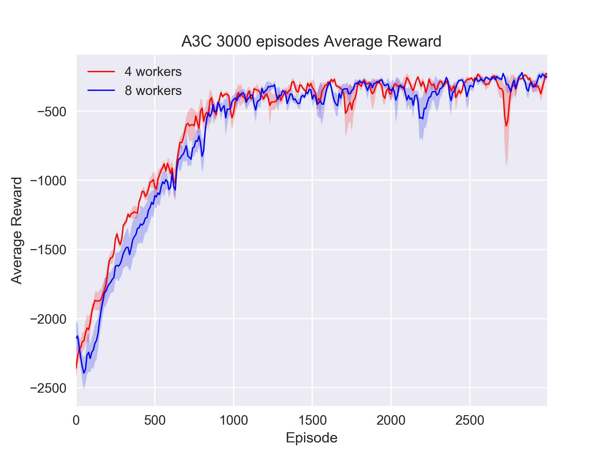
