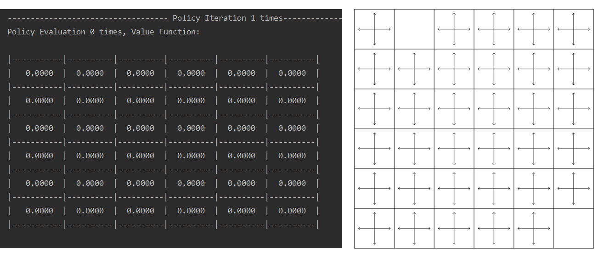
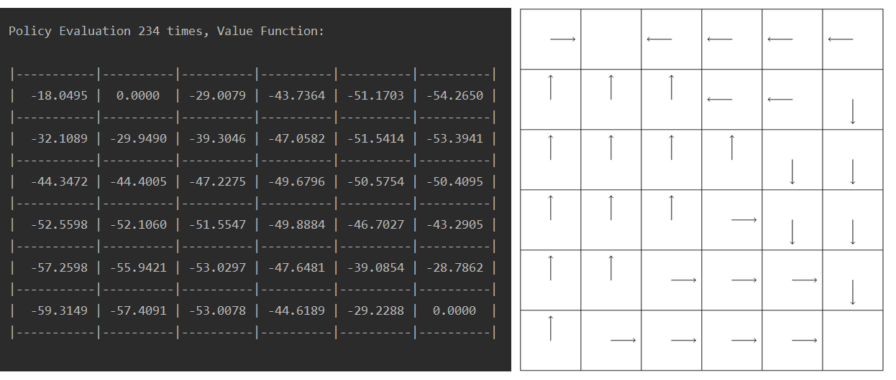
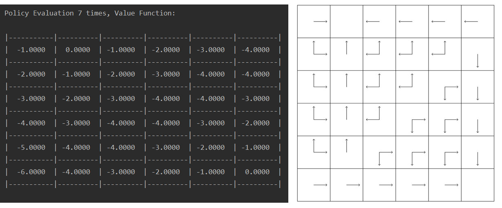
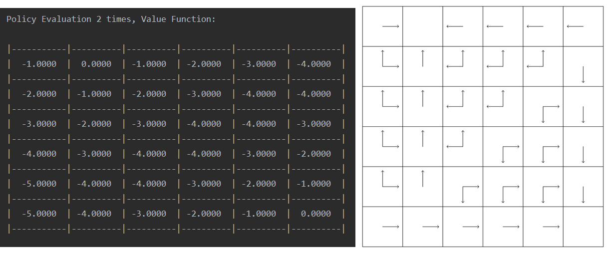
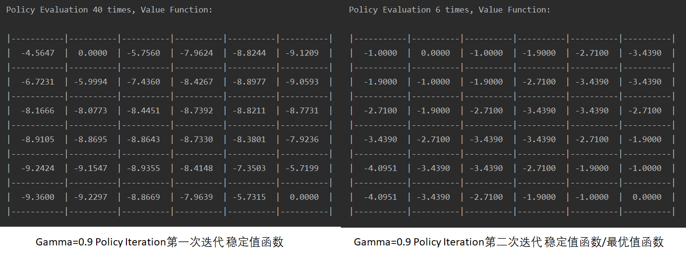
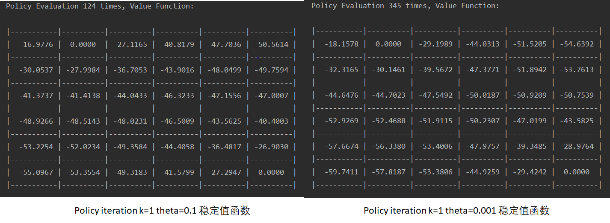
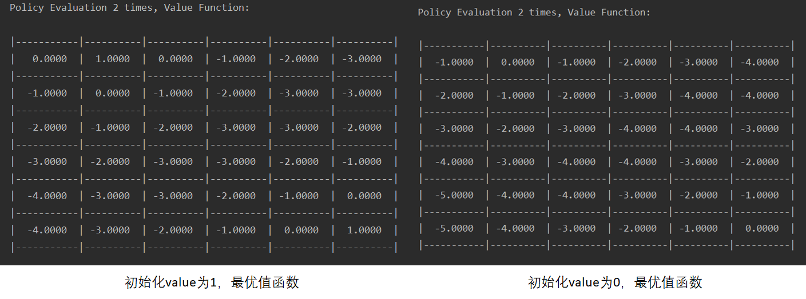
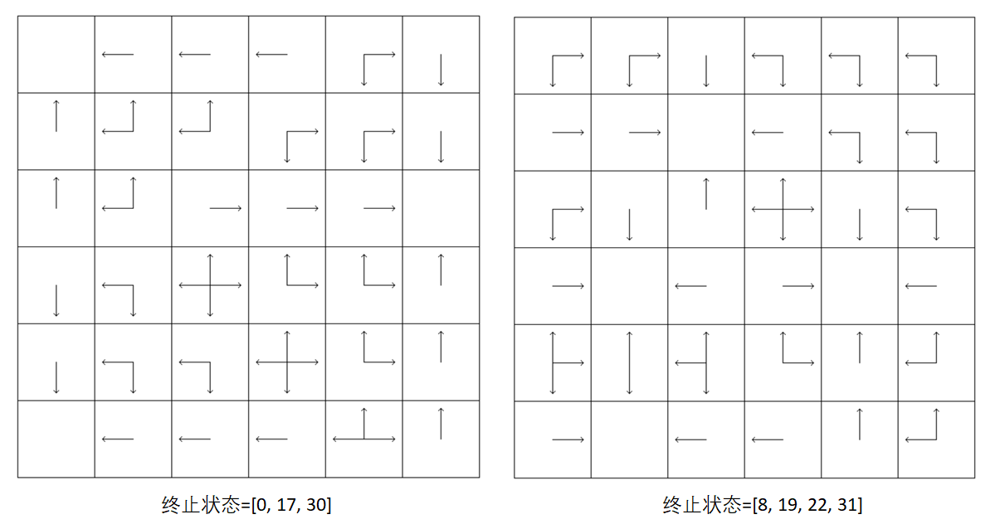
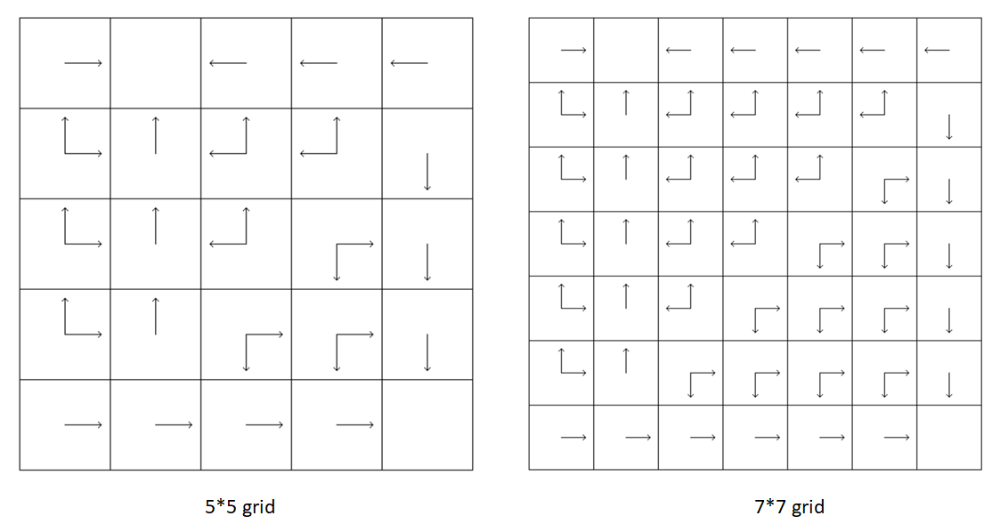
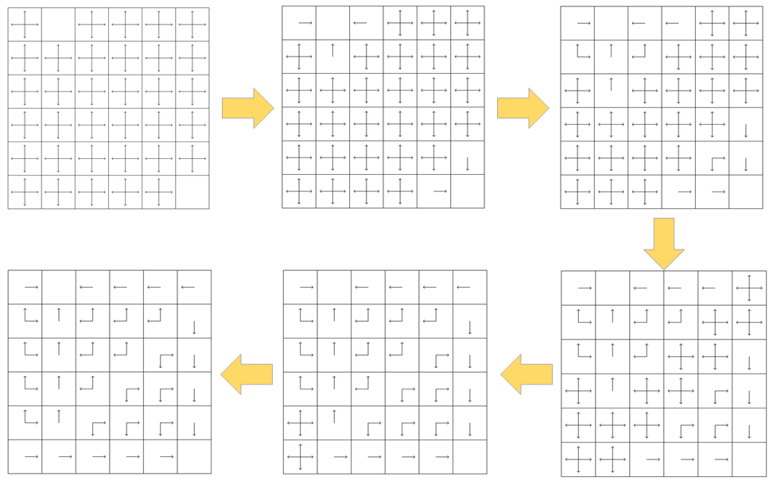

# Small Gridworld(Policy Evaluation&Policy Iteration)

### 一、实验要求

1. 建立Gridworld环境

2. 用Policy Evaluation和Policy Iteration的方法从随即均匀的策略得到最优策略

   

### 二、实验分析

#### 1. Gridworld环境建立

首先初始化Gridworld环境，需要传入边长grid_len和终止状态，然后确定状态为0~$(grid\_len)^2-1$、默认折扣因子为1、全部行为为['n', 's', 'w', 'e']、奖励为设置为离开每个非终止位置获得-1的奖励，终止状态不会进行下一步所以不会有奖励。初始化所有状态的值函数为0，所有的Policy都是均匀随机（即非终止状态都为['n', 's', 'w', 'e']，终止状态则没有policy以保证终止），`self.act_trans`则会确定这四个行为会相应的如何改变状态。

```python
def __init__(self, grid_len, terminal, gamma=1):
    self.grid_len = grid_len                            # edge length of grid word
    self.states_num = grid_len ** 2                     # number of states
    self.states = [i for i in range(self.states_num)]   # all states
    self.values = [0 for i in range(self.states_num)]   # values of states
    self.terminal = terminal                            # all terminal states
    self.gamma = gamma                                  # discount factor
    self.reward = -1                                    # reward
    self.actions = ['n', 's', 'w', 'e']                 # all actions
    self.act_trans = {'n': -grid_len, 's': grid_len, 'w': -1, 'e': 1}     
    # how action lead to state changing
    self.policy = [['n', 's', 'w', 'e'] for i in range(self.states_num)]  
    # policy at each state, initially uniform
    for x in self.terminal:                             # terminate at terminal states
        self.policy[x] = []
```

下一个函数是如何通过当前状态和行为得到下一个状态，通过`self.act_trans`确定下一个位置后还要判断有没有过界，如果过界就返回原状态。

```python
def getNextState(self, state, action):
    next_state = state + self.act_trans[action]
    # return to current state if next state is out of grid
    if next_state < 0 or next_state >= self.states_num or (
        next_state % self.grid_len != state % self.grid_len and next_state // self.grid_len != state // self.grid_len):
        next_state = state
    return next_state
```


#### 2. Policy Evaluation和Policy Iteration

在Policy Evaluation中，首先要确定一个比较小的数$\theta$来判断值函数有没有收敛，这里取$\theta=0.01$。采取同步更新的方法，`self.values`中存的是前一次迭代得到的值函数，`new_values`中存的是本次的值函数，对所有的状态`state`（不包括终止状态），采取的策略存在`self.policy[state]`中，采取其中每个行为的概率都均等，由此可以算出$\pi(a|s)$，也就是代码中的`trans_prop`，然后根据行为和状态可以得到下一个状态，由贝尔曼方程，我们可以得到当前`state`新的值函数，$\delta$存的是新旧值函数的最大差距，如果差距小于$\theta$就认为收敛，大于就继续循环。

```python
def policyEvaluation(self):
    theta = 0.01
    delta = 1
    while delta > theta:
        delta = 0
        # synchronous backups
        new_values = [0 for i in range(self.states_num)]
        for state in self.states:
            if self.policy[state]:
                trans_prop = 1 / (len(self.policy[state]))
            for action in self.policy[state]:
                next_state = self.getNextState(state, action)
                new_values[state] += (self.reward + self.gamma * self.values[next_state]) * trans_prop
                delta = max(delta, abs(new_values[state] - self.values[state]))
         # update value function
         self.values = new_values
```

在Policy Iteration中，首先采取policy evaluation得到当前策略下收敛的值函数，然后在每个状态（不包括终止状态）选出使得值函数最大的行为，作为新的策略。如果所有状态下新的策略和旧的策略一样，说明已经是最优策略，否则就继续迭代。

```python
def policyIteration(self):
    stable = False
    while not stable:
        self.policyEvaluation()				# policy evaluation
        stable = True						# policy improvement
        for state in self.states:
            old_policy = self.policy[state]
            if state not in self.terminal:
                # find best policy
                max_value, policy = -9e10, []
                for action in self.actions:
                    next_state = self.getNextState(state, action)
                    new_value = self.reward + self.gamma * self.values[next_state]
                    if new_value > max_value:
                        max_value = new_value
                        policy = [action]
                    elif abs(new_value - max_value) < 1e-9:
                       	policy.append(action)
                # update policy
                self.policy[state] = policy
                if set(old_policy) != set(policy):
                    stable = False
```

#### 3. 可视化/输出结果

在policy evaluation迭代过程中在命令行输出当前值函数，将函数值输出为6*6的gird，包括边界和gird中的值。

```python
def outputValue(self, k):
    print("Policy Evaluation", k, "times, Value Function:")
    for i in range(self.grid_len):
        print('\n' + '|' + ('-'*21 + '|') + ('-'*20 + '|') * 5)
        print("|", end=' ')
        for j in range(self.grid_len):
            state = i * self.grid_len + j
            print(str(self.values[state]).center(20), end='|')
    print('\n' + '|' + ('-'*21 + '|') + ('-'*20 + '|') * 5)
    print('\n')
```

在policy iteration过程中输出每次更新的policy，这里采取使用了tkinter画图，先确定每个grid的起始位置， 然后用`canvas.create_rectangle()`画出方格，再根据该位置的policy用`darwArrow()`函数在方格中心点画出箭头，`darwArrow()`函数可以根据输入位置、箭头长度和箭头方向画出所需的箭头（由于不太相关这里没有列出函数定义）。

```python
def outputPolicy(self, k):
    # window and canvas
    app = Tk()
    app.title('Policy Iteration ' + str(k) + ' times, Optimal Policy:')
    canvas = Canvas(app, bg='white', width=800, height=800)
    canvas.pack()
    # draw policy
    begin_x, begin_y, edge, arrow_len = 100, 50, 100, 40
    for i in range(self.grid_len):
        for j in range(self.grid_len):
            state = i * self.grid_len + j
            print(self.policy[state], end=' ')

            x, y = begin_x + j * edge, begin_y + i * edge
            canvas.create_rectangle(x, y, x + edge, y + edge)
            for action in self.policy[state]:
                drawArrow(x + edge // 2, y + edge // 2, arrow_len, action)
    mainloop()
```


### 三、实验结果

#### 1. 结果分析以及最终结果

初始化时，所有状态值函数为0，非终止位置policy均匀随机，如下：



Policy Iteration第一次迭代时，Policy Evaluation迭代234次时得到左图稳定的值函数，根据新的值函数我们可以得到右图新的Policy。



Policy Iteration第二次迭代时，Policy Evaluation只迭代7次时就得到左图稳定的值函数，根据新的值函数我们可以得到右图新的Policy，其实这个时候的值函数和policy就已经是最优了，但是还没有判断是否稳定，所以会再进行一次迭代。



Policy Iteration第三次迭代，得到的结果和上一次一样，所以可以判断policy稳定，所以这个值函数和策略就是最优的值函数和策略，因此我们得到了最终的结果：



#### 2. 拓展实验

##### 2.1 折扣因子$\gamma$改变

折扣因子的改变主要会改变值函数，但一般不会影响最优策略。

gamma为0.9时Policy Iteration同样经历三轮，每轮的得出的policy都是和gamma=1时相同，但是值函数不同。



gamma变化较大时也会引起中间轮的policy发生变化，gamma=0.5时，policy iteration仍迭代三轮，但第一轮得出的policy发生变化，但是最后最优的policy仍然保持不变。gamma=0.1时迭代5轮，中间policy变化，但是最后最优policy不变。不过gamma一般也不会选这么小的数。

##### 2.2 控制policy evaluation迭代结束的变量$\theta$改变

theta改变时，Policy evaluation收敛的速度会改变，中间值函数的结果也会有不同，但是不影响最后最优值函数和最优策略。theta越小收敛越慢，但是值函数会更精确，考虑到policy iteration会有多次迭代，这里theta的取值可以稍微大一点




##### 2.3 值函数初始值

值函数初始值改变基本上没啥影响，就是最后值函数会改变，策略都没有变，全体初始化为1时的最优值函数比全体初始化为0时整体加一。应该和更新方式相关，在我的设定里，无论是值函数还是策略函数，在终止状态都是不更新，那么初始化终止状态的值函数就是最后时的值函数。重要的不是值函数的具体值而是和其他状态值函数的差值，这才决定下一步策略往哪里走。



后来也尝试了随机初始化为(0, 1]之间的实数，策略和而迭代次数都没有改变，也只是值函数具体的值发生变化，所以值函数初始化方式一般没有太大影响。


##### 2.4 初始策略改变

初始策略改变影响比较大，糟糕的初始化策略可能使得值函数比较难收敛甚至无法收敛，我尝试过每个位置初始化策略都设为['n']、['n', 's']、['n', 'w']、['n', 's', 'w']，结果都迭代了上万步都没有收敛。也试过在每个位置随机选一个action，但是往往也很难收敛。所以还是不要瞎搞，老老实实从均匀随机的策略初始化吧。


##### 2.5 Reward改变

这个实验源于最开始我看错了题目，看成了到达终止状态奖励为1否则奖励为-1，这种理解其实就是在到达一个状态的时候获得reward。后来发现题目里并没有给出到达终止状态的奖励，所以应该理解为从每个状态离开的时候获得的reward是-1，到达终止状态后不会再离开所以不需要reward。两种做法结果上并没有多大区别，还是只有值函数数值不同，policy都是一样的。

至于其他的reward改变方式，只要每一步reward都是负数，结果总是可以收敛到同一个policy。


##### 2.6 终止状态改变

在6*6 grid下尝试了其他的终止状态得到的最优policy：




##### 2.7 Gridworld方格个数改变

改成5\*5 和 7\*7 gird，终止状态为1、24和1、48得到的最优policy



可以看到终止状态相对位置类似时会有一些类似的模式，实际上中间生成的policy也有类似的模式，5\*5、6\*6、7\*7 Gridworld policy iteration都迭代了三次，其中第一次policy evaluation比较花时间，三个迭代次数分别为141、234、358次。


##### 2.8 Value Iteration

value iteration相当于是policy iteration中每次迭代时把policy evaluate中迭代次数简化到一次，每一次得到新的值函数后，就根据新的值函数，选可以令值函数最大的action作为新的policy，直到值函数稳定，具体代码如下，theta取0.01。

```python
while delta > theta:
    delta = 0
    new_values = [0 for i in range(self.states_num)]
    for state in self.states:
        if state not in self.terminal:
            max_value, policy = -9e9, []
            for action in self.actions:
                next_state = self.getNextState(state, action)
                new_value = self.reward + self.gamma * self.values[next_state]
                if new_value > max_value:
                    max_value = new_value
                    policy = [action]
                elif abs(new_value - max_value) < 1e-9:
                    policy.append(action)
            new_values[state] = max_value
            delta = max(delta, abs(max_value - self.values[state]))
            self.policy[state] = policy
   self.values = new_values
```

value iteration速度比policy iteration快很多，在相同条件下（6*6 grid， 终止状态为1、35），value iteration只迭代了六次就得到最优策略，而policy iteration第一轮policy evaluation就迭代了234次。代码量上value iteration也更胜一筹。


