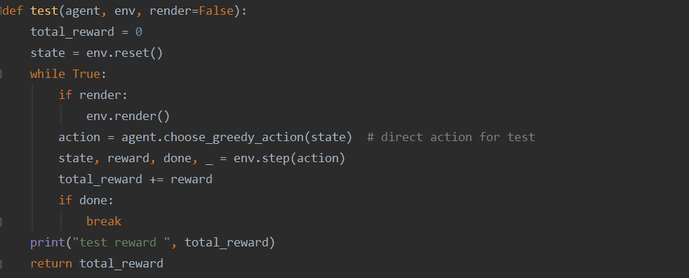

## DQN

### 1. Introduction

In classical Q-learning methods, the action value function Q is intractable with the increase of state space and action space. Deep Q network (DQN), which combines the advantage of Q-learning and the neural network, introduces the success of deep learning and has achieved a super-human level of play in atari games. In this experiment, I implement DQN algorithm and its improved algorithm, Double DQN and Dueling DQN and prioritized experience replay DQN, and play them in a classical reinforcement learning control environment–MountainCar.

MountainCar is on a one-dimensional track, positioned between two "mountains". The goal is to drive up the mountain on the right; however, the car's engine is not strong enough to scale the mountain in a single pass. Therefore, the only way to succeed is to drive back and forth to build up momentum. It's observation and actions and reward are listed as follows.

### 2. Procedure

Here I implement several DQNs, including basic DQN, Double DQN, Dueling DQN, priority experience replay(PER) DQN and their combinations.

#### 2.1 Network

First, I implement the network of DQN uses as a independent class. The following code shows the basic network. Given that MountainCar is not very complex, this network is quit simple and only has one hidden layer. 

I also implement Dueling DQN, which modifies the structure of network. The following code shows the the network of Dueling DQN. After a dense layer, features go to two branches, one for computing value function and the other one for computing action advantage function. Then add the two branches together and we get the final output. 

#### 2.2 Replay Buffer & Priority Replay Buffer

The implementation of replay buffer is quiet simple. If it is full, replace the oldest data. If not, just add data to the end of the array. When sampling, just randomly pick some.

The implementation of priority replay buffer is based on Sum Tree. Sum Tree is a Binary Tree where the value of a node is equal to sum of the nodes present in its left subtree and right subtree. Here, we put priority on leaf node and associate it to our data. The root value x is the sum of all priority.  Then we sample uniformly in range[0, x], and the larger the priority is, the more likely associated transition will be chosen. 

In priority replay buffer, I slightly modify the TD error and use it as priority. It's important to point out that my implementation of PER DQN is a simplified version. I just use Sum Tree to perform weighted sampling. In original version, every experience is associated with a importance-sampling weight, which also used as a weight when we compute loss.

Next, to sample a batch of size k, the range [0, total_priority] will be divided into k ranges. A value is uniformly sampled from each range.

More details can be found in memory.py

#### 2.3 DQN

The initialization of this class need many parameters. `state_dim`  and `action_dim` are the dimension of state space  and action space. `hidden_dim` is how many hidden units evaluate net and target net have.  `memory_size` is the max capacity of replay buffer. `target_update` is the frequency of target net updating.  `use_per`, `use_double` and `use_dueling` control whether model use those method or not. 

The following code shows how `use_per` and `use_dueling` affect the initialization of model.

Function `choose_action()` uses epsilon-greedy algorithm to choose action from results outputted by evaluate net. Action chosen by this function will be used to interact with environment. In this class, there is another function `choose_greedy_action()` , which uses greedy algorithm to choose actions.

Function `get_td_error()` computes TD error, that is $R+\gamma  max_a Q'(S',a)-Q(S,A)$. This function will be used when we use PER DQN because we use TD error as priority .

Last but not least, function `update()` is about how to update the network.  First, update target net if  it reaches the frequency of target net updating.

Then, get mini-batch  from replay buffer and convert its content to tensor. It is noteworthy that `Transition` is a namedtuple and its definition is `Transition = namedtuple('Transition', ('state', 'action', 'reward', 'next_state', 'done'))`

The following part is calculating loss. 

If we use Double DQN, the target is $r_t+Q'(s_{t+1},argmax_aQ(s_{t_1}, a))$, where $Q$ is evaluate net and $Q'$ is target net. If not, the target is $r_t+max_aQ'(s_{t+1},a)$. As we only update evaluate net, here target net uses distach. Then, we will update evaluate net via gradient calculated by pytorch.

There are several simple functions that I don't mention. Function `add_to_replay_buffer()` will add transition to replay buffer. Function `load()` and `save()` are about how to load and save the model.

#### 2.4 DQN train & test

When training, the number of episode will be inputted. The following code shows what we do in an episode. First, reset the environment and begin this episode. Agent chooses action by epsilon-greedy and environment returns what the action gets. 

The reward of MountainCar is very sparse. It gets positive reward only when car reached the peak and gets -1 reward otherwise, which make it hard to train. So, I modify the reward and encourage car to reach higher. Later, I talk more about the effect of modifying reward in Part 4.

Then, pack all those we get to a namedtuple and add it to replay buffer. The update step will not begin until the replay buffer reaches 1024.

Test step is more straightforward. We don't need to update net or add transition to replay buffer. Agent just chooses best action and perform it. The total reward will be returned.

#### 2.5 Other

The function `train_in_differnt_setting()` in DQN.py will train model according to input setting , save model and results, and plot picture of loss and rewards.

Function `plot_data()` in Plotting.py is responsible for plotting figures.

### 3. Results

#### 3.1 Parameters

Here are the main parameters I use in training and they remain the same when I try different DQN. Because `env = gym.envs.make("MountainCar-v0")` automatically sets the max step of an episode to 200.  I use `env = gym.envs.make("MountainCar-v0").unwrapped` which allows infinite step per episode. 

|     Parameter Name     | Value |   Parameter Name   | Value |
| :--------------------: | :---: | :----------------: | :---: |
|        epsilon         |  0.1  |     batch size     |  256  |
|      memory size       | 20000 |   learning rate    | 0.001 |
|         gamma          |   1   | target update step |  100  |
| max step of an episode |  600  |    hidden unit     |  100  |

#### 3.2 Results

I've tried five settings, basic DQN, double DQN, dueling DQN, PER DQN, and PER double Dueling DQN. 

The left diagram shows smoothed rewards of these five setting. Because of smoothing method, the begin and end part of curve are distorted and should be ignored. The right diagram shows non-smoothed rewards. Given that non-smoothed rewards are complex and it's hard to discern five non-smoothed rewards curves in a single diagram, I only take double DQN and PER double Dueling DQN as an example.

As we can see in the left diagram, compared with basic DQN, other four DQNs do perform better and converge faster. PER double Dueling DQN performs best not only because of its fast converging speed, but also because it's more stable and gets higher reward. The left diagram, rewards without smoothing, makes it clearer that PER double Dueling DQN converges faster and has less fluctuation and gets higher rewards.

### 4. Discussion

#### 4.1 The Effect of Modifying Reward

When I use  `env = gym.envs.make("MountainCar-v0")` , which set the max step of an episode to 200, I find that the original reward of MountainCar is very sparse. It only has negative reward -1 and it's hard for car to reach the peak randomly. This makes it hard to train because the possibility of get positive reward is very small and we may be stuck in all those negative rewards. 

So, we need to modify the rewards and encourage car to reach higher. The ideal reward should meet the following demands

* The higher the position is, the larger the reward is.
* Make car reach the peak as soon as possible.

I find that modifying the reward to $reward+e^{|state[0]+0.5|}$ works very well. If I modify reward, car can reach the peak within 40 episodes. If not, the car can't reach the peak even if I train 200 episodes.

But when I use `env = gym.envs.make("MountainCar-v0").unwrapped` and set larger max step of an episode, I find the reward modification has little impact on results or even has negative impact on final results. Here, linear modified reward is $reward + \frac{state[0]+0.5}{max\_pos - min\_pos}$ and exponential modified reward is $reward+e^{|state[0]+0.5|}$.

The following diagram shows how reward modification affects the final rewards we get. Under the current setting,  it's unnecessary to modify the reward, since the performance of linear modification is about the same with original reward(non-modified) and the performance of exponential modification is even worse.

The reason behind the poor performance of exponential modification may be that the modified rewards are all positive. Agent tends to get more rewards but reaching peak as soon as possible may not bring more rewards. Despite agent get less original rewards, it may get  more modified rewards. So it doesn't converge and has large fluctuations.

#### 4.2 What if swap $Q$ and ${Q'}$ in double DQN

In Double DQN, I try to swap the position of target net and evaluate net and expect to get similar results. That is I use $r_t+Q(s_{t+1},argmax_aQ'(s_{t_1}, a))$ rather than $r_t+Q'(s_{t+1},argmax_aQ(s_{t_1}, a))$, where $Q$ is evaluate net and $Q'$ is target net. But I find it can't  even converge.  

Finally, I figure out that if we swap them, the target is calculated by evaluate net, which is ever changing. Actually that's what we want to avoid and the reason we use a fixed target net.

