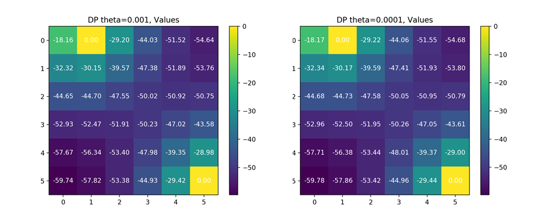
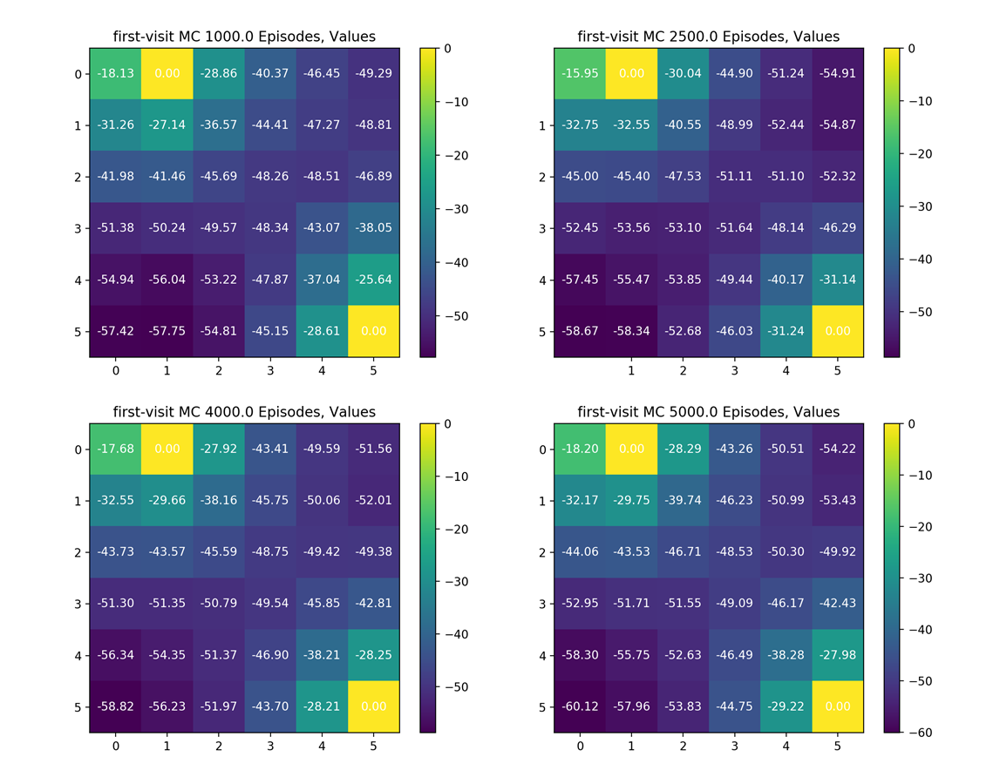

## Assignment 2 MC & TD Prediction Report

### 1 Experiment Requirements

* Programming language: python 3 

* You should implement both first-visit and every-visit MC method and TD(0) to evaluate state value in small grid world.

  

### 2 Code & Analysis

#### 2.1 Environment

Given that MC and TD methods focus on unknown MDP, here I split environment and prediction model. 

First, initialize the gridWorld class with edge length and terminal states. State space, action space, reward, and how state changes with action, that is `self.act_trans`, are defined here.

Then,  function `getStates()` returns all states, function `getTerminal()` returns all terminal states, and function `getAction()` returns all possible actions. 

We can use function `generateInitialState()`, which returns a initial state randomly chose from non-terminal states, to reset the environment. 

Function `getNextState()` finds reward and next state according to current state and action. It also returns whether the next state is terminal state.

Function `generateEpisode()` can generate an episode according to input policy. First, generate the initial state. Then, keep going according to policy and restore state, action, and reward until terminal state is reached. Finally, return the sequences of states, action, and reward.

#### 2.2 Model free prediction

Because MC model and TD model have got a lot in common, I create a base class called `ModelFree`.  Environment is essential to initialization while policy and discount factor gamma is selective. If not given, policy will be initialized to uniform random policy and discount factor will be initialized to 1.

We can use function `setPolicy()` to set a new policy.

There are also some functions about output and visualization in class `ModelFree`. Given the weak link between those function and our theme, I only list their names and usage. The implement detail can be found in source code. Function `outputValue()` prints values of states in gridWord-style to command line. Function `plotValues()` can visualize  the values of states via heatmap. Function `plotDelta()` can  plot the figure how delta(the max difference between values of this update and last update)  change with episodes.

#### 2.3 First-visit & every-visit MC

Class `MC` is a derived class of `ModelFree`.

Monto-Carlo policy evaluation uses empirical average sample return. To avoid repeated calculation, I use function `computeEisodeReturn()` to compute return at each step of  an episode.

The most important function `_MCPolicyEval()`, used in both first-visit MC and every-visit MC, need two inputs, number of episode `episode_num` and `visit_method`, either 'first' or 'every'.  First, initialize all the states and counters of states to zero. Then, use function of environment to get a whole episode and compute its returns. Traverse states in this episode and check if the state is visited for the first time or visit method is 'every'. If so, increase the count of  the state,  update value by incremental mean $\frac{G_t - V(S_t)}{N(S_t)}$, and update `delta`, the max difference between values of this update and last update.  Finally, loop the second step for `episode_num` times.

Then, in function `firstVisitMCpolicyEval()` and `everyVisitMCPolicyEval()`, we only need to call function `_MCPolicyEval()` with different visit method.

#### 2.4 TD(0)

Class `TD` is also a derived class of `ModelFree`.

The key function `TD0PolicyEval()` is listed as follows.  Since TD updates value toward not actual return $G_t$ but estimated return $R_{t+1}+\gamma V(S_{t+1})$, we don't need to wait for the end of whole episode but can update value as soon as environment reaches next step. 

First, generate the initial state. Then, choose action according to policy, get reward and next state, update value via $\alpha [R + \gamma V(S^{ '})-V(S)]$, and loop until this episode ends. Finally, loop above steps for `episode_num` times.

### 3 Results & Analysis

Theoretically speaking, we can evaluation any policy. Here, take uniform random policy as example.

Other problem is that I don't have a real value function for uniform random policy. DP method I used in last assignment does give a good approximation of true value function. I will use the it as a approximation of true value.

Actually, later I find uniform random policy is hard to evaluate and the results I get and convergence may vary from training to training. I try optimal policy I get in DP method and it turns out its training, whose details are shown in part 4, is much easier. 

Given that if we don't know any information about policy, it's a good idea to start with uniform random policy, I still take uniform random policy as example here. Its results are listed as follows.

#### 3.1 First-visit MC 

It's hard to tell when First-visit MC method converges.  In between 1000 to 5000 episodes, values may fluctuate around the real values. After that, values become more stable but still vibrate. Because I use $\frac{G_t - V(S_t)}{N(S_t)}$ to update $V(S_t)$, as the number of episode increases, $N(S_t)$ increases and  $\frac{G_t - V(S_t)}{N(S_t)}$ becomes small, therefore, values become more stable.

Here, I also plot a picture of value function and delta I got at 10000 episodes. It's very close to what l get via DP policy evaluation. As for delta, it decreases as number of episode increases, despite of vibration. Although its decrement may mainly comes from $1/N(S_t)$, to some extend, it can still act as as a sign of convergence. From this picture, we can observe that delta decrease more smoothly after 5000 episode, that's why values become more stable after that.

#### 3.2 Every-visit MC

The result of every-visit MC is similar to first-visit MC.

 In between 1000 to 4000 episodes, values may fluctuate around the real values. After that, values become more stable but still vibrate. 

This tendency is also shown in picture of delta, delta decrease more smoothly after 4000 episode when values become more stable.

#### 3.3 TD(0) 

 As shown in illustration, delta increases and then become stable after 1200 episodes when parameter    $\alpha$ equals to 0.1. The reason why this tendency is different from that in MC method is that TD(0) method uses $\alpha [R + \gamma V(S^{ '})-V(S)]$ to update value while MC method uses $\frac{G_t - V(S_t)}{N(S_t)}$ . As the number of episode increases, $\frac{G_t - V(S_t)}{N(S_t)}$ decreases and gradually approaches  zero while $\alpha [R + \gamma V(S^{ '})-V(S)]$ will be affected by a fixed parameter $\alpha$ and approaches some number related to $\alpha$. 

Actually, parameter $\alpha$ does affect a lot and I will talk about it later in part 4.

Despite that TD(0) method converges faster, its vibration is larger than MC method, as illustrations show. This largely results from the fact that $\alpha$ is too large to fit the number of episodes.  

### 4 More experiments & Analysis

#### 4.1 Use incremental mean alpha in MC

At class, we talked about updating $V(S_t)$ via $\alpha[G_t - V(S_t)]$.  Here, I take first-visit MC as example and set alpha equals to 0.01. The picture of delta is similar to that in TD(0). Although it seems to converge fast in the first picture, values does fluctuate wildly and I don't think it performs well.

The performance of every-visit MC is similar to first-visit MC. 

Therefore, we can reach the conclusion that using $\frac{G_t - V(S_t)}{N(S_t)}$ maybe better than $\alpha[G_t - V(S_t)]$

#### 4.2 Alpha in TD(0)

TD(0) method is sensitive to alpha. As shown in illustration, converging speed and stable delta dropped obviously with alpha decreasing. When alpha equals 0.001, it don't converge even at 20000 episodes. With alpha decreasing, the vibration of values also diminishes. 

Alpha can be viewed as learning rate, showing how important the difference is. If it is large, model learns fast but may not converge or produce fluctuates greatly. If it is small, model learns slowly but has good convergence properties. Inspired by $1/N(S_t)$ used in MC method, alpha should be large if the number of episode is small and alpha should decrease as number of episode increases. So it's a good idea to diminish alpha as number of episode increases.

Here, I initialize alpha to 0.1 and diminish it to `60/total episodes` every 600 episodes after 1200 episode.  As we mentioned in part 3, 1200 episode may close to convergence and diminishing alpha can reduce vibration.

As shown in illustration, values are more stable when evaluated by dynamic alpha.

#### 4.3 Evaluate optimal policy

I also evaluate other policy, like the optimal policy I got via DP method in last assignment. It's much easier to evaluate than uniform random policy. 

The optimal policy and values I got via DP are listed as follows.

In this training, First-visited method converges to optimal values in between 40 and 50 episodes.

In this training, every-visited method converges to optimal values in between 50 and 60 episodes.

Converges speed of TD(0) method is sensitive to alpha. It takes 3000 episodes  to optimal values when alpha is 0.1(left picture) while model with alpha equal 0.1 converges at 80 episodes.

Why I emphasize "in this training" is that the episodes I sampled are random and may be quite different from training to training, which may result in different converging speed.

#### 4.4 Compare converging speed among three method

There are two reason why I don't compare those three method in above parts. First, when evaluating uniform random policy, it's hard to say when they converge. Second, they use different episodes which is random sampled and get different information, which make it hard to compare their performance in policy east to evaluate.  It's better to compare batch MC and TD on same finite experience.

#### 4.4 Initial value sensitivity

As shown in slides at class, TD(0) is more sensitive to initial value, while MC not.

I wonder whether initial value contains initial terminal state value. If so, the result of MC and TD(0) will all change. If not, I don't think the result will change, so the sensitivity may come from converging speed. Given the reason I list in part 4.4, It's hard to compare converging speed under this setting. 

