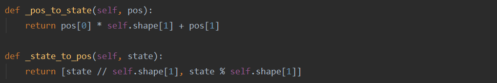
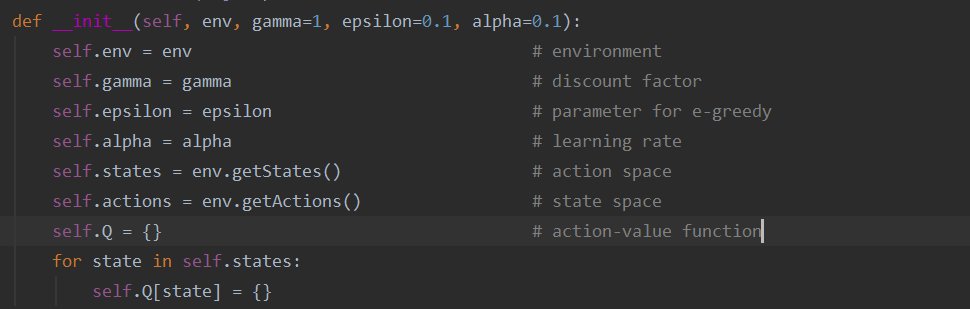
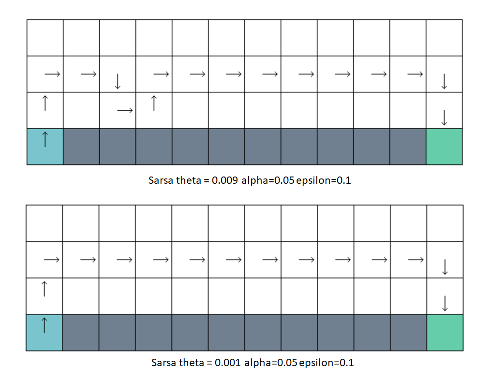
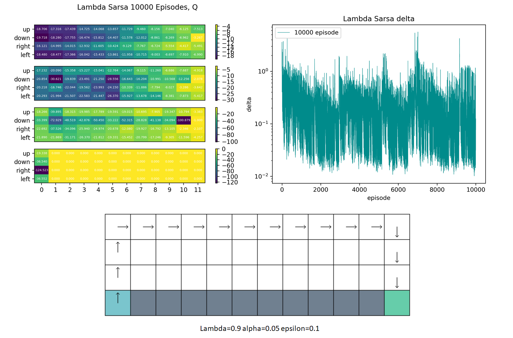

## Model Free Control 

### 1 Experiment Requirements 

• Programming language: python 3 

• Build the Cliff Walking environment and search the optimal travel path by Sara and Q-learning, respectively. 

• Different settings for $\epsilon$ can bring different exploration on policy update. Try several $\epsilon$ (e.g. $\epsilon$ = 0.1 and $\epsilon$ = 0) to investigate their impacts on performances.

### 2 Experiment Process

#### 2.1 Cliff Walking Environment

I build a class called `CliffWalking`. On its  initialization, one can choose to input the shape, start position, and end position of Cliff Walking environment or use the default values. Then, the action space and state space are defined.  The variable `self.grid` describes how the grid world, where 1 stands for cliff position, 2 for start point, and 3 for end point.

Then, I pre-compute all the possible transitions. The variable `self.transition` is a nested dictionary, which records reward and next states of every possible state and action. Later, we will call function `step()`, which returns things restored in `self.transition` .

Because state is a number between 0 and 47, we need to convert state to and from position, that is the following two functions.

Given current position and how to move next, function `_calculate_trasition()` will return next state, reward, and whether end state is reached.

Besides, there are some simple functions, such as `getActions()`, `getStates()`, `getStartState()`, `step()`. They are quit simple so I don't list them here.

#### 2.2 Model Free Control

Since Sarsa and Q-Learning have a lot in common, I build them in same class `ModelFreeControl`. Here I list and explain some things they share.

Initialization of this class is very simple. Environment is essential while parameter like `gamma`(discount factor), `epsilon`($\epsilon$-greedy parameter), `alpha`(learning rate) is selective. Then follows initialization of actions, states and action-value function Q.

Actually, initialization of action-value function Q here is partial.  Every time we use Sarsa or Q-learning method, the following function will be called, which initialize Q(state, action) to zero.

Another thing in common is using greedy or $\epsilon$-greedy algorithm to choose action.  In greedy algorithm, we just pick up the action whose Q is maximal. If there are multiple choices, just pick up one randomly.

Based on greedy algorithm,  $\epsilon$-greedy explores all the possible actions with non-zero probability. With probability $1-\epsilon $, the greedy action will be chosen and with probability $\epsilon$, an random action will be chosen.

There are also some functions about output and visualization. Given the weak link between those functions and our theme, I only list their names and usage. The implement detail can be found in source code. Function `outputQ()` prints action-value function in  command line. Function `plotQ()` can visualize  the action-value function  via heatmap. Function `plotDelta()` can  plot the figure how delta(the max difference between values of this update and last update)  changes with episodes. Function `drawPath()` will visualize the final path the method learns.

#### 2.3 Sarsa

Here, I implement on-policy control Sarsa in function `sarsa()`. First, initialize action-value function Q to zero. Then, in each episode, get start state and choose action via $\epsilon$-greedy. Function `self.env.step()` is called to get next state, reward, and whether terminal state is reached. Once again, choose action for next state via $\epsilon$-greedy. Then we can update the action-value function via the following formula 

$$Q(S, A)\leftarrow Q(S,A)+\alpha[R+\gamma Q(S',A')-Q(S,A)]$$

Keep on with this until this episode ends.

Variable `delta` records the max difference between action-values of this update and last update. If `delta` is larger than a specified threshold `theta`, keep sampling episodes.

#### 2.4 Q-Learning

I implement off-policy control Q-Learning in function `Q_learning()`, which is quit similar to `sarsa()`. The only difference is Q-learning uses two policy, target policy for updating action-value function Q and behavior policy for interacting with environment. The behavior policy, that is variable `action`, is chosen by $\epsilon$-greedy algorithm and the target policy, that is variable `next_action` , is chosen by greedy algorithm. 

### 3 Experiment Results

#### 3.1 Q-Learning

##### One Possible Result

With epsilon=0.1, alpha=0.02, and theta=0.001, iteration of Q-Learning ends when the number of episode reaches 4629. The action value function and delta variation diagram are shown as follows.

The following drawing shows the path I get and it’s evident that it's the optimal path.

##### Variation of  $\epsilon$

I've tried different $\epsilon$ while other parameters stay the same and found that it doesn't affect the final path but affects the converge speed and action-value function Q. In Q-Learning, the target policy used to update Q is improved by greedy algorithm, so the change of $\epsilon$ doesn't affect the final path we get. Behavior policy is improved by $\epsilon$-greedy, so it affects how agent interacts with environment.

When $\epsilon$ is large, $\epsilon$-greedy algorithm tends to choose random action, so average episode length is longer. Despite that number of episode is less, it's converging speed is much slower. When $\epsilon$ is small, things go in opposite way. But it seems the shortest average episode length doesn't appear when  $\epsilon$ equals to 0 but is close to $0.1$. Less exploration may result in hard start and longer episode length at the beginning.

|  value of $\epsilon$   |    1    |   0.9   |  0.5   |  0.3   |  0.1  | 0.01  |   0   |
| :--------------------: | :-----: | :-----: | :----: | :----: | :---: | :---: | :---: |
|   number of episode    |   563   |  1259   |  3833  |  3937  | 3535  | 2030  | 1796  |
| average episode length | 6590.05 | 805.99  | 52.80  | 35.14  | 27.03 | 33.42 | 35.81 |
|       total step       | 3710170 | 1014745 | 202374 | 138358 | 95553 | 67846 | 64329 |

I think it's hard to say what's the true action value function, but the difference may be understandable. When $\epsilon$ is small, $\epsilon$-greedy algorithm tends to choose greedy action, therefore, the state which isn't on the optimal path has less and less chance to appear and improvement of associated Q becomes slower and slower, as the number of episode increases. But when $\epsilon$ is large, they still have many chances to be chosen and improved. That's why action-value function of those states may be quite different.

I've tried different values of theta and alpha, and I will talk about it later in Part 4.

#### 3.2 Sarsa

During the experiment, I find that not only the result, that is path and action-value function, but also whether it converges, varies with $\epsilon$. Here, I've tried two settings, fixed $\epsilon$ and changeable $\epsilon$.

##### Fixed  $\epsilon$   

Since Sarsa only use one policy improved by $\epsilon$-greedy and may continue to explore even after convergence, it's convergence isn't very well if $\epsilon$ is fixed and slightly big number. Therefore, it's hard to use parameter theta and delta to decide when to stop iteration, so I fixed the maximum number of episode to 15000.

When $\epsilon=0.01$, it converges to optimal path.

When $\epsilon=0.1$, it converges to a safer path.

When $\epsilon=0.5$, it converges to the safest path.

I also try many other values of $\epsilon$, but above diagrams show three typical cases. When $\epsilon$ is large, it tends to converge to safer solution while it tends to choose optimal solution when $\epsilon$ is small. 

In my opinion, target policy of Q-learning is improved by greedy algorithm. It won't be affected by $\epsilon$ and exploration and won't update Q via actions resulting in going to cliff. Thus, Q-learning reaches optimal path. But in Sarsa, the policy is generated by $\epsilon$-greedy algorithm and will affected by exploration. Action-value function Q may be updated by actions resulting in going to cliff, so those action-value near cliff may decrease. The larger $\epsilon$ is, the more likely Q is updated by actions resulting in going to cliff, and the smaller those Q near cliff are. Therefore, we get a path far away from cliff, that is a safer path, when $\epsilon$ is large. When $\epsilon$ is very small, it explores hardly and tends to reach optimal path.

##### Changeable $\epsilon $

Inspired by GLIE, I think it's a good idea to reduce $\epsilon$ as the number of episode increases. It reduces exploration when it's close to convergence, so its convergence will be more stable.

Here, I set $\epsilon=1/(k+2)$, where k is the current number of episode. As shown in following diagram, it converges to optimal path.  Under this setting, it explores less when it's close to convergence and tends to reach optimal solution.

### 4 More Experiments

#### 4.1 Parameter Theta & Alpha

Parameter theta controls when the iteration ends and parameter alpha is learning rate, to some extend. Actually, how to choose those two parameter has close link with convergence and when to stop. Since alpha corresponds to learning rate, the smaller alpha is , the longer time it takes to converge.  

For Q-Learning, when theta is big, it stops too early and can't get a stable path. As theta decreases, it takes longer time to stop, but the path is more stable and action-value function Q is more accurate. Here theta is big means that theta is big compared with alpha. If theta is bigger than or close to alpha, it usually doesn't reach convergence when it stops. My experiments shows that for Q-Learning, it's better to choose theta that is at least 20 times smaller than alpha.

In Sarsa, similarly, when theta is bigger than or close to alpha, it stops too early and can't converge and get a stable path, and it's also a good idea to choose theta close to numbers that are 20 times smaller than alpha.  But unlike Q-Learning, theta smaller than that may result in endless loop, as Sarsa explores even if it's close to convergence, which results in fluctuation  of Q, and if the range of fluctuation is larger than theta, there exists endless loop.

If changeable alpha is used in Sarsa, small theta is more appropriate.

#### 4.2 Initial Q value

I've tried both  random and zero initialization of non-terminal states in Sarsa and Q-Learning. The difference between them isn't significant, so I don't display those digram here.

#### 4.3 Sarsa$(\lambda)$

I implement backward view Sarsa$(\lambda)$, which uses eligibility traces.  It has one eligibility trace for each state-action pair updated in following way.

$$E_0(s,a) = 0, E_t(s,a)=\gamma \lambda E_{t-1}(s,a)+\bold{1}(S_t=s,A_t=a)$$

The way $Q(s,a)$ is updated also changes. 

$$\delta_t = R_{t+1}+\gamma Q(S_{t+1}, A_{t+1})-Q(S_t,A_t),  Q(s,a)\leftarrow Q(s,a) + \alpha \delta_t E_t(s, a)$$

First, initialize $Q(s, a)$ to zero. Then, for each episode, initialize $E(s, a)$ to zero and at every step, update $E(s,a)$ and $Q(s,a)$ for each state-action pair according to the formula above.

Given that Sarsa$(\lambda)$ updates the whole action-value function Q every time it takes an action and observes reward, it's slower than Q-learning and  Sarsa. I also find that use theta here often results in stopping too early or endless loop, so I use a fixed number of episode such as 10000.

Here is the result when lambda equals to 0.9 and epsilon equals to 0.1. It chooses the safest path, which also happens when epsilon equals to 0.5 and 0.01.

When lambda equals  to 0, the result is similar to Sarsa. 

When lambda equals to 1, it may get infinite Q if gamma is 1, so I set gamma to 0.9. At first, it may take a long time to finish a episode, but before long, its speed becomes fast. Unfortunately, it's converging speed is very slow and there isn't a stable path even when the number of episode reaches 15000. I finally get the stable path when it's 20000 episodes.

